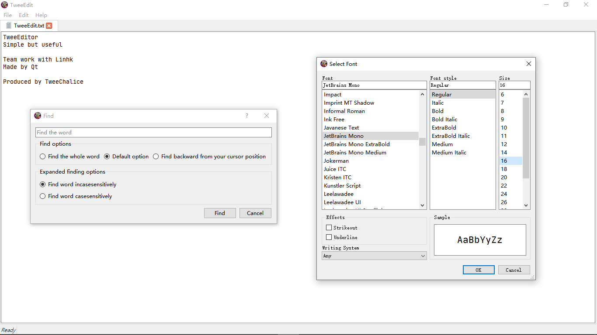

<h1>TweeEditor</h1> <b style='font-size:.9em;color:#1faaa7'>A cross-platform text editor powered by Qt 5</b>

Chinese translation: _Linhk_
Origin translation: _TweeChalice_

# Under Mozilla Public License 2.0

#####  If you copy this project and create your own package with it, You MUST use the same license and show the details where the project comes from. And display this license and copyright notice as well.
###### Its copyright always belongs to TweeChalice.  If you assign privately, you need to agree with me

# Team work with [Linhk](https://github.com/Linhk1606 "Linhk")
  
 TweeChalice and Linhk are students and make this application together. This application is simple, so we hope that someone can give me some advise on changing better.
 

 If you have some problems to let us know, please write your problems in 'Issues'.
  
